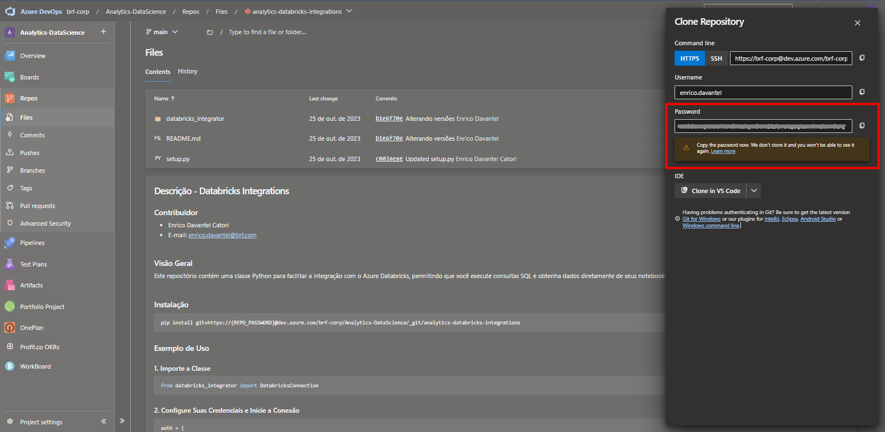

# Data Project Template

## Author
- [Rodrigo Watanabe Pisaia](rodrigo.pisaia@brf.com)
- [Matheus Melara Girardi](matheus.girardi@brf.com)

## Getting Started
To get started with this project you need to:

<br>O __REPO_PASSWORD__ é obtida no momento em que você clica em __Clone__ na aba do repositório, conforme a imagem:


<br>
__NOVO_PROJETO__: é o nome da pasta do novo projeto (ex: brf-anltcs-csc-gente)

```bash
pip install uv

cd /home/azureuser/cloudfiles/code/Users/YOUR.NAME

uvx cookiecutter https://{REPO_PASSWORD}@dev.azure.com/brf-corp/Analytics-DataScience-MLOps/_git/brf-anltcs-pipeline-example
```

## Project Organization
```
.
├── LICENCE
├── README.md
├── data
│   ├── external
│   ├── interim
│   ├── processed
│   └── raw
├── models
├── notebooks
│   ├── azuremlconnections.py
│   └── general.py
├── pipe
│   ├── __pycache__
│   │   └── azureml_env_build.cpython-310.pyc
│   ├── azureml_env_build.py
│   ├── azureml_pipe_orchestrator.py
│   └── utils
│       ├── __init__.py
│       ├── __pycache__
│       │   ├── __init__.cpython-310.pyc
│       │   └── compare_env_version.cpython-310.pyc
│       └── compare_env_version.py
├── references
├── release
│   └── release_template.json
├── reports
│   └── figures
├── requirements.txt
└── src
    ├── 01_load_data.py
    ├── 02_preprocessing.py
    ├── 03_model_inference.py
    ├── 04_post_processing.py
    ├── __init__.py
    ├── config
    │   └── pipe_env
    │       └── env.yml
    ├── modeling
    │   └── __init__.py
    ├── services
    │   └── __init__.py
    └── utils
```